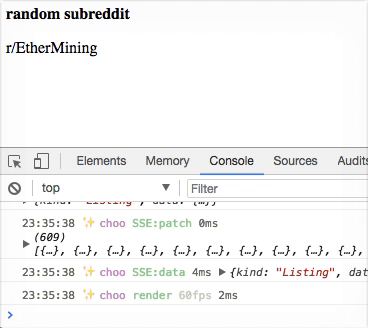

# choo-streamdata.io

> small glue code around the [streamdata.io-events](https://github.com/jekrb/streamdata.io-events) browser API and [choo](https://github.com/choojs/choo)

Adds streamdata.io events to the choo event emitter.

## Usage

```js
var choo = require('choo')
var html = require('choo/html')
var devtools = require('choo-devtools')
var streamdata = require('choo-streamdata.io')

var url = 'https://www.reddit.com/r/random.json?obey_over18=true'
var key = 'ODRlZDNmYmUtMDAxZC00NWJmLTgwMzQtNTkzMWJiYjFhYjVj'

var app = choo()
app.use(devtools())
app.use(streamdata(url, key))
app.use(SSE)

app.route('/', mainView)
app.mount('body')

function mainView (state, emit) {
  return html`
    <body>
      <strong>random subreddit</strong>
      <p>${state.subreddit}</p>
    </body>
  `
}

function SSE (state, emitter) {
  emitter.on('DOMContentLoaded', function () {
    emitter.on('SSE:data', function (data) {
      console.log(data)
      state.subreddit = data.data.children[0].data.subreddit_name_prefixed
      emitter.emit('render')
    })
  })

  emitter.on('SSE:opened', function () {
    console.log('SSE opened')
  })

  emitter.on('SSE:error', function (err) {
    console.error(err)
  })

  emitter.on('SSE:patch', function () {})

  window.onunload = function () {
    emitter.emit('SSE:close')
  }
}
```

## Example


## API

### `SSE:opened`
Occurs when the SSE is opened

### `SSE:data`
Occurs when the SSE emits a new data event (full data update with patch applied)

### `SSE:patch`
Occurs when the SSE emits a new patch event (patch is just whats changed since the last patch or data event)

### `SSE:error`
Occurs when the SSE throws a new error

### `SSE:open`
Emitting this event will open the SSE connection if its been closed.

### `SSE:close`
Emitting this event will close the SSE connection. 

## Install

With [npm](https://npmjs.org/) installed, run

```
$ npm install choo-streamdata.io
```

## Acknowledgments

choo-streamdata.io was inspired by..

- [`YerkoPalma/choo-websocket`](https://github.com/YerkoPalma/choo-websocket)

## See Also

- [`choo`](https://github.com/choojs/choo)

## License

[MIT](https://tldrlegal.com/license/mit-license)

